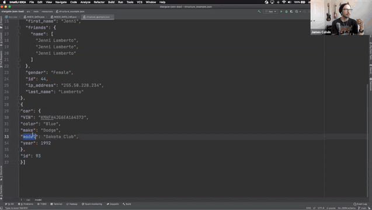

# Loading JSON data with DataStax Astra and Stargate
[Stargate](www.stargate.io) is an open-source API framework for data. 
This demo will show how we can quickly spin up an Apache Cassandra cluster on DataStax Astra with the Stargate Document API enabled and load JSON documents.
Stargate's document API enables users to use Apache Cassandra as a schemaless document database.
##### _wAiT... wHaT??_
Create a table and load `JSON` data completely schemaless! On Apache Cassandra! 
You can use this demo to illustrate loading `JSON` data of differing shapes and depths into the same "table" and query on a common (or not common) attribute! 
### Get Started!
1. Create an Astra Free Tier database on GCP
2. Put your database UUID, cloud region, user name, password, and keyspace name into the [java variables](./src/main/java/org/example/App.java)
3. Run the example program
4. Import the HTTP requests into [Postman](https://www.postman.com/) and test!

### Contribution and Feedback
The [Stargate community](https://stargate.io/community) needs you! Please consider contributing to the community, submitting feature requests, filing bugs, and developing your own API's!  